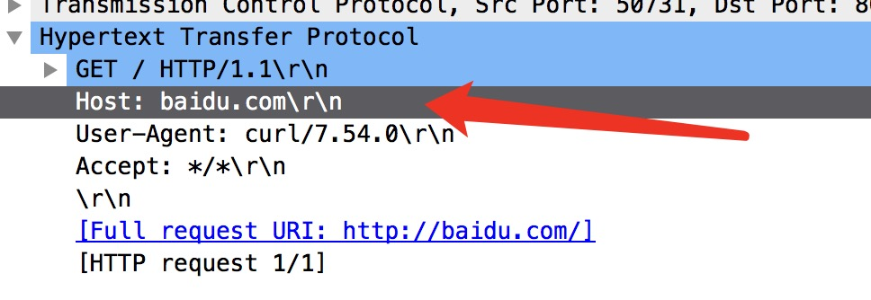

Sower 是一套实现透明代理的完整解决方案，本文将从第一视角，剖析 sower 中使用的技术点，供学习交流之用。

项目地址：[github.com/wweir/sower](https://github.com/wweir/sower)

# 缘起

要说想写代理工具，得从 2017年10月至11月这段特殊时间说起。这段时间全网实行白名单，导致绝大部分国外的站点都无法访问，这对于一个使用 `golang` 作为主力语言的程序员来说，无疑是致命的。期间发现 `ICMP` 协议可以正常访问，于是萌生了写一个基于 `ICMP` 代理工具的想法。奈何当时技术能力有限，经过两三个月的调研、学习，决定先搁置这个方案。

之后花了一段时间补足网络方面认知的空缺，同时分析了大量的代理类工具，看到了原生透明代理类工具的巨大空缺。在 Linux 平台上，利用内核的部分特性，尚有部分此类工具存在，而 Windows、macOS 等平台上，此类工具近乎绝迹江湖。大家普遍在使用 `pac` 作为路由层，其自身限制颇多。首先，大量工具并不支持` pac`，其次，路由规则一多，性能堪忧。

18 年 6 月，偶然的机会，从一位牛人那里了解到他正在使用的基于 DNS 的透明代理解决方案，经过一段时间的摸索之后，便有了 sower 设计的雏形。

# 技术概览

实现简单的代理很简单，但要隐藏传输过程中的数据、流量的特征，需要一系列的**伪装**、**加密**手段，这就是一件很复杂的事了。同时，为了避免流量的远距离往复传输，应当提供相应的**路由**手段，这同样不是一件简单的事情。

## 网络访问基本流程

学习 sower 中使用的技术点之前，我们应该知道一个普通的网络访问究竟是怎么进行的。

1. 首先，软件(如：浏览器) 发起一个网络访问的请求
2. 如果请求的是域名，获取 DNS 获取其对应的 IP 地址。这其中还涉及 hosts 及 DNS 缓存等一系列服务
3. 软件与目标服务器的 TCP 80 / 443 等端口建立连接，并发送对应的 HTTP(S) 流量
4. 目标服务器通过之前建立的连接，返回请求内容，断开连接
5. 软件处理返回的结果

## 整体思路

sower 中核心思想是**利用 http 请求中的 `Host` 字段以及 https 请求的 `sni` 支持，获取目标服务的地址**。这样 我们就可以撇开常规的代理协议，直接在 TCP 层偏转 http、https 的访问，彻底解放了代理工具对软件代理协议支持的依赖。

实际实现也是如此，**sower 没有使用任何已有的代理协议，直接在传输层 (TCP) 接管了 HTTP(S) 访问的流量**。

这样一来，我们要做的就很简单了：

1. DNS 服务：路由分发，偏转特定请求的流量到我们自己的服务
2. Client 端：承接 TCP 请求，加密流量，并发送加密后流量至 server 端
3. Server 端：接收加密流量，解密，解析出目标服务器地址，并将解密后流量发送至目标服务器

## 类似工具链

Sower 中当前没有使用任何黑科技，都是已有的常规技术。

sower 提供的大多数功能，[v2ray](https://www.v2ray.com/) 中都有提供。不过 v2ray 的 DNS 功能太弱，很难玩出花样。同时，配置文件的说明文档能单独写成一本书，说明要么自身太过复杂，要么没有实现用户友好。

如果你愿意尝试的话，也可以用类似如下的一组工具组合来实现类似的功能：

- dnsmasq
  - 提供 DNS 服务，转发 DNS 请求。针对特定场景，甚至可以修改 hosts 达到类似的效果
  - 将指定域名，解析到自己的服务器地址，实现分流，如：将 `*.google.com` 解析到 `192.168.1.2`
- nginx
  - 实现正向和反向代理
  - 正向承接 dnsmasq 偏转过来的流量，打到后续的代理通道中
  - 反向接受代理工具打过来的流量，代理到实际访问的地址
- privoxy
  - 转换代理协议，将 http(s) 代理协议的流量转换为 socks5 代理协议
- shadowsocks
  - 提供 socks5 代理服务
  - 实现流量通道的加密，最终公网跑的是 shadowsocsks 加密后的流量

# 技术剖析

## DNS 服务

### 技术选型

市面上最常见的路由手段是 pac，不过在我们这个场景下，pac 并不能满足我们的要求。pac 实现的是根据请求的 `URL`，偏转流量到指定代理服务，而我们的核心思想是抛开代理协议，直接传输 TCP 流量，二者有不可调和的冲突。

`Iptables` 是我们最常见到的透明代理解决方案。如果愿意的话，是可以配合 sower 使用的。但是如果默认使用 `iptables` 方案，基本就意味着 sower 只能在 Linux 主机上使用了。实际上 macOS 的 `Network Extension` 也可以实现类似的效果，可惜这份苹果税太过感人，基本使用不上。

类似的实现方式还有：使用特殊网卡驱动，解析特定类型网络报文，这个就属于黑科技了，难度高、效果好。请原谅，由于技术难度和作者自身技术体系的原因，这个方案目前还没有仔细研究过。

`Hosts` 是另一种可以满足需求的选择，但 `hosts` 自身有硬伤，域名不能写通配符，必须进行全匹配。这就导致我们要写的规则量将变得数量巨大，全匹配还导致没有好的方式处理新访问的域名。同时，`hosts` 是绑定机器的，这意味着我们需要手动设置每个使用 sower 的终端的 `hosts` 文件，这对部分操作系统是不现实的，如：iOS。

最终，我们将目光锁定到了 `DNS` 身上。首先， `DNS` 可以轻松实现将流量偏转至我们自己的服务地址。其次，`DNS` 的规则可以由编程实现，自由度很高，支持通配符更是不在话下。同时，`DNS` 是一个几十年前就存在的老协议，绝大多数网络系统都对 `DNS` 有着优秀的支持，特别是支持低权限下自定义 `DNS`  服务地址。如果你愿意的话，甚至可以在路由器等网络基础设施上进行相关设置，实现全局透明代理。

### 困难点

为什么没有首先考虑 DNS 方案呢？因为 DNS 有其自身的复杂性：

1. 默认情况下 DNS 使用 UDP 进行交互，UDP 流量的很多行为和 TCP 不同，需要转换很多思想

2. 作为几十年前的老协议，其 [RFC](https://www.isc.org/community/rfcs/dns/) 文档已经有快 200 份了，其报文类型更是数不胜数，很难理解透彻

3. TCP 是传输层协议，而 DNS 是为网络层 (IP) 服务的，二者不是一一对应的，使用 DNS 做路由分发，必然有所误伤

幸运的是，这几个问题都是可以克服的。

首先，我们找到了 **[miekg](https://github.com/miekg/dns)** 对 DNS 协议的一个不错的封装，这样我们就不用自己去实现 DNS 的一整套东西了。

还有就是，想明白一个重要的事：**我们只是要偏转对指定域名的访问，至于这个域名需要几层解析才能得到真实 IP，可以全权交给 server 端去做**。我们就只需要返回指定域名的 A/AAAA 解析记录就可以，服务端会重新解析这个域名到目标服务器 IP。

本来以为第三点会是个严重的问题，而实际使用中，并没有带来多大的问题，至少作者使用 sower 的这段时间里，还没有遇到任何问题。由于我们只偏转了指定域名的访问，只要这些 Web 服务的域名没有同时提供其它网络服务，就不会有问题。实际上，出于安全、管理等原因，大的 Web 服务提供商，**提供 Web 服务的服务器并不会对外提供其它网络服务**。

### 拓展点

Pac、iptables、hosts 之类的方案更多是提供一套**配置**给已有的软件使用，这就要求给每个需要配置代理的软件提供一份配置，这是个 1:1 强绑定关系。而 DNS 是一个独立的**网络服务**，可以轻易实现 1:N 的配置关系，这样方便进行统一的管理和使用。

独立的网络服务相比配置文件级的配置方案，还可以轻松实现动态配置。比如：新访问一个不在配置中的被屏蔽域名，可以在后台跑一套检测逻辑，检测出该域名是否被屏蔽。这样，下次访问该的域名的时候，就可以正常访问了。这也是接下来一段时间 sower 的一个开发方向。

### 代码实现

使用  **[miekg](https://github.com/miekg/dns)** 的 DNS 库，监听 UDP 53 端口，启动一个 DNS 服务。对于在规则中的域名，直接返回指向 `127.0.0.1` 的 A 解析记录。其余域名的请求，代理请求到指定的域名服务，如：电信运营商、114、阿里的域名解析服务。

为了实现高效的规则匹配，代码中独立实现了一个基于后缀匹配的 [Trie-Tree](https://zh.wikipedia.org/wiki/Trie)。这最初是为了解析 [gfwlist](https://github.com/gfwlist/gfwlist) 准备的，无奈 gfwlist 和 DNS 的域名映射实在难以画上等号，只得放弃，仅在这里做一个高性能规则匹配器而存在。

## 代理服务

代理服务的工作流程很清晰，基本可以分为 6 步：

1. 监听请求

2. 加密

3. 网络传输

4. 解密

5. 解析目标服务地址

6. 转发请求至目标服务

### 监听请求

正如前面描述的，自己的 DNS 服务改变了域名、IP 之间的映射关系，将访问特定域名的流量偏转到我们自己的服务。但 DNS 是无法偏转端口的，因此我们不得不监听自身的 TCP 80 / 443 端口，这也是 sower 的 client 端必须以 root 权限运行的原因之一。另一个需要 root 权限的原因是监听 UDP 53 端口来提供 DNS 服务。

作为福利， sower 默认还监听了 TCP 8080 端口，提供普通的 HTTP(S) 代理服务，给部分不方便变更 DNS 的场景带来一定的便利，如：vm、docker。

### 加、解密

这本是一大难题，还好已经有众多前辈在前面铺好了路，这里直接借鉴了 [Shadowsocks](https://github.com/shadowsocks/go-shadowsocks2) 的加密实现方式。

鉴于 Stream、Block 两种加密方式被诟病已久，sower 只支持 AEAD 的加密方式。Layout 设计与 shadowsocks 完全一致，开头两个字节描述 size，后续跟着实际数据。

与 shadowsocks 唯一不同的是 nonce 的设计，sower 直接使用了 golang 提供的伪随机发生器，而 shadowsocks 是自己实现的。后续要开发其它语言的 sower 实现的话，可能要变更相应的伪随机发生器算法。

### 网络传输

sower 直接接管了 TCP 的网络流量，这就使得我们在网络传输方面可以做很多文章，我们可以随意将 TCP 流量转换到其它协议中。目前已经支持的传输层协议有：QUIC、KCP、TCP，其中部分协议尚未稳定，需对默认参数进行调节。

其中部分协议基于 UDP 实现，而 UDP 是可以实现打洞的，这就意味着两台互相隔离的机器也可以通过代理进行无需流量转发的访问了。Broker 正是为了解决打洞的具体实现方案而提出的。

同时，一年多前研究过的 ICMP 协议，也有相应的计划进行支持。研究了很久的东西终于有机会落地了。

### HTTP(S) 协议解析

能**从跑着 HTTP(S) 协议的普通 TCP 流量中解析出目标服务器的地址，是 sower 这类工具的立足之本**。HTTP 是文本传输协议，可以其中从其中的 Host 字段获取目标服务器地址 ，如果你用抓包类工具看过 http 流量的话，可以轻松观察到这一点。

相比之下，从 HTTPS 协议中分析出目标服务器地址就没那么容易了。所幸，十几年前人们为了实现 HTTPS 协议的反向代理，立下了一个 TLS 的[拓展标准](https://tools.ietf.org/html/rfc3546)，[SNI](https://zh.wikipedia.org/wiki/%E6%9C%8D%E5%8A%A1%E5%99%A8%E5%90%8D%E7%A7%B0%E6%8C%87%E7%A4%BA) 便是其中的一项重要的标准。经过十几年的发展，该项标准早已被大多数网络工具所支持，至少作者还没遇到什么日常软件不支持 SNI。同样，在抓包工具中同样能从加密后的流量中看到 SNI 的身影。

相比原理，代码实现要简单多了，http 直接用[标准库](https://godoc.org/net/http#ReadRequest)进行解析，HTTPS 则用了 google [tcpproxy](https://github.com/google/tcpproxy/blob/master/sni.go) 的实现代码。同时为了使 TCP 流量能够**反复读**，自己实现了一个 [tee_conn](https://github.com/wweir/sower/blob/v0.2.0/parse/tee_conn.go)。

### 转发请求

转发流量至目标地址，无疑是这几个流程中最没技术含量的流程了。首先去连接解析出的地址，然后将接收到的流量转发到新建立的连接即可。

需要注意，这里有一个隐藏的、自动执行的动作，就是根据域名解析目标服务器的地址。解析过程中可能遇到**多种**、**多层** DNS 解析记录，需要一层层解析下去。所幸这个流程被自动执行了，我们自己的 DNS 服务只需要返回 A 解析记录的报文即可，反正后面都会重新解析一次。

# 总结

技术层面的东西讲完了，总结一下就是：

- DNS 将部分站点的流量引流至自身

- 自身将流量加密后送至远端，实现代理

## 回顾

作为一个业余项目，从最初计划，到最终实现，断断续续花了一年多时间，其中真正投入开发、调研的时间算起来将近一个月。这一年多的时间里，了解了大量的网络知识，学习、尝试了多种网络协议及其具体实现。虽然消耗了大量自己的空闲时间，但最终看到 sower 目前的项目完成度，还是很满意的。

写 sower 的过程中还了解了大量开源文化、项目组织、软件工程方面的东西。如果你在平时生活过程中也遇到了什么不爽的东西，不妨也来写一个开源的业余小项目吧。

## 展望

sower 虽然已经达到了可用的软件成熟度，但部分场景下任然不够稳定，同时文档、部署、测试等方面也还不够。

同时，还可以在这几个方向还可以进行一些比较有意思的尝试：

- DNS 服务规则的智能化，自动学习新访问的地址，自动创建规则
- 更多网络层协议的支持，包括之前调研了很久的 ICMP
- 利用 UDP 打洞技术，实现一些神奇的，甚至不可描述的功能